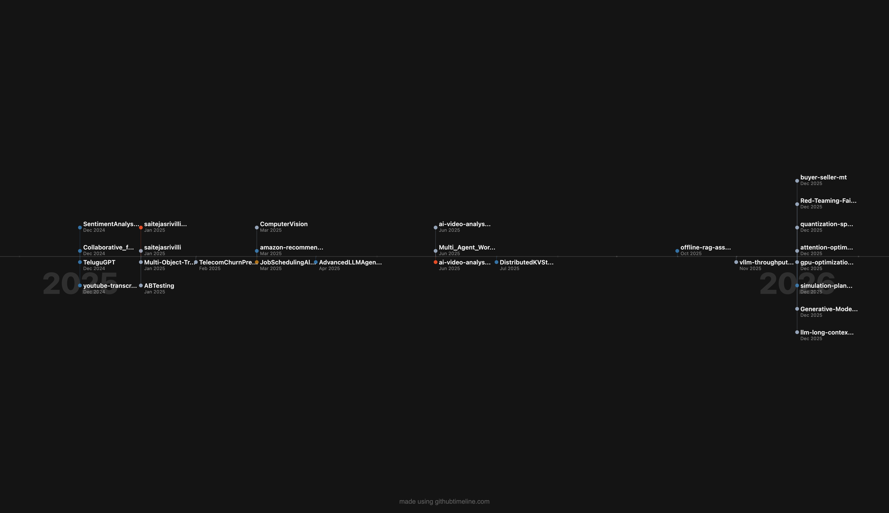

<div align="center">
  
# 👋 Hi, I'm Sai Teja Srivillibhutturu

### ML & Deep Learning Engineer | LLM Specialist | Cloud Architect

[](https://linkedin.com/in/saitejasrivilli)
[](https://github.com/saitejasrivilli)
[](https://scholar.google.com/citations?user=StKZohYAAAAJ)
[](https://saitejasrivillibhutturu.github.io)

</div>

---

## 🎯 Professional Summary

**ML & Deep Learning Engineer** with expertise in **GPU optimization**, **LLM inference**, and **cloud-native AI solutions**. Achieved **12.3× throughput improvement** and **4× memory reduction** in production ML systems. Passionate about building scalable AI infrastructure and deploying cutting-edge models to production.

---

## 📊 GitHub Activity Timeline

<div align="center">
  
</div>

*Consistent contributions across ML/AI projects from 2024-2026*

---

## 🛠️ Technical Skills

<table>
<tr>
<td valign="top" width="33%">

### 🤖 ML/DL & LLMs
- PyTorch, TensorFlow, JAX
- Transformers, LangChain
- RAG, Vector Databases
- LoRA, QLoRA Fine-tuning
- Inference Optimization
- vLLM, Speculative Decoding

</td>
<td valign="top" width="33%">

### ☁️ Cloud & Infrastructure
- AWS (Certified Data Engineer)
- Oracle Cloud (GenAI Certified)
- Microsoft Fabric
- Docker, Kubernetes
- MLOps, CI/CD Pipelines
- Distributed Systems

</td>
<td valign="top" width="33%">

### 💻 Software Engineering
- Python, Go, C++
- FastAPI, Flask
- PostgreSQL, Neo4j
- Redis, Kafka
- System Design
- Data Structures & Algorithms

</td>
</tr>
</table>

---

## 🚀 Featured Projects

### 🔥 LLM & GPU Optimization

| Project | Description | Impact |
|---------|-------------|--------|
| [**vllm-throughput-benchmark**](https://github.com/saitejasrivilli/vllm-throughput-benchmark) | Comprehensive benchmarking suite for vLLM inference optimization | **12.3× throughput, 4× memory reduction** |
| [**gpu-optimization-mistral**](https://github.com/saitejasrivilli/gpu-optimization-mistral) | GPU memory optimization for Mistral model deployment | Production-ready optimization |
| [**quantization-speculative-decoding-benchmark**](https://github.com/saitejasrivilli/quantization-speculative-decoding-benchmark) | Speculative decoding implementation for faster inference | Significant latency reduction |
| [**attention-optimization**](https://github.com/saitejasrivilli/attention-optimization) | Custom attention mechanisms for efficient transformers | Memory-efficient attention |
| [**LORA-implementation**](https://github.com/saitejasrivilli/LORA-implementation) | Low-Rank Adaptation for efficient fine-tuning | Parameter-efficient training |

### 🤖 AI Agents & Multi-Agent Systems

| Project | Description | Tech Stack |
|---------|-------------|------------|
| [**AdvancedLLMAgent**](https://github.com/saitejasrivilli/AdvancedLLMAgent) | Sophisticated LLM agent with tool use capabilities | LangChain, RAG |
| [**Multi_Agent_Workflow_Automator**](https://github.com/saitejasrivilli/Multi_Agent_Workflow_Automator) | Multi-agent orchestration system | Agent frameworks |
| [**offline-rag-assistant**](https://github.com/saitejasrivilli/offline-rag-assistant) | Privacy-focused RAG system for offline deployment | Vector DB, Embeddings |

### 🔬 ML Systems & Production

| Project | Description | Tech Stack |
|---------|-------------|------------|
| [**ai-video-analysis-system**](https://github.com/saitejasrivilli/ai-video-analysis-system) | End-to-end video analysis with CV models | PyTorch, CV |
| [**ComputerVision**](https://github.com/saitejasrivilli/ComputerVision) | Computer vision algorithms and implementations | OpenCV, Deep Learning |
| [**TeluguGPT**](https://github.com/saitejasrivilli/TeluguGPT) | Language model for Telugu language | Transformers, NLP |
| [**TelecomGPT**](https://github.com/saitejasrivilli/TelecomGPT) | Domain-specific LLM for telecom industry | Fine-tuning, Domain Adaptation |

### 📊 Data Engineering & ML Pipelines

| Project | Description | Tech Stack |
|---------|-------------|------------|
| [**DistributedKVStore**](https://github.com/saitejasrivilli/DistributedKVStore) | Distributed key-value store implementation | Go, Distributed Systems |
| [**end-to-end-data-engineering-project**](https://github.com/saitejasrivilli/end-to-end-data-engineering-project) | Complete data pipeline from ingestion to analytics | ETL, Cloud |
| [**Collaborative_filtering_recommender_system**](https://github.com/saitejasrivilli/Collaborative_filtering_recommender_system) | Scalable recommendation engine | Spark, ML |
| [**TelecomChurnPredictor**](https://github.com/saitejasrivilli/TelecomChurnPredictor) | Customer churn prediction system | PySpark, ML |

### 🛡️ AI Safety & Evaluation

| Project | Description | Focus |
|---------|-------------|-------|
| [**Red-Teaming-Failure-Analysis-Mitigation**](https://github.com/saitejasrivilli/Red-Teaming-Failure-Analysis-Mitigation) | LLM red teaming and safety evaluation | AI Safety |
| [**Generative-Model-Safety-Evaluation-LLMs-Diffusion-Models**](https://github.com/saitejasrivilli/Generative-Model-Safety-Evaluation-LLMs-Diffusion-Models) | Safety benchmarks for generative models | Evaluation |
| [**llm-long-context-stress-test**](https://github.com/saitejasrivilli/llm-long-context-stress-test) | Long-context capability testing | Benchmarking |
| [**simulation-planning-evaluation**](https://github.com/saitejasrivilli/simulation-planning-evaluation) | Planning capabilities evaluation | Agent Evaluation |

---

## 🏆 Certifications

<table>
<tr>
<td align="center" width="25%">

<br><sub>Dec 2024 - Dec 2027</sub>
</td>
<td align="center" width="25%">

<br><sub>Aug 2025 - Aug 2026</sub>
</td>
<td align="center" width="25%">

<br><sub>Jun 2024 - Jun 2026</sub>
</td>
<td align="center" width="25%">

<br><sub>Feb 2025</sub>
</td>
</tr>
</table>

### 🎓 Specialized Training

| Certification | Issuer | Date | Key Skills |
|--------------|--------|------|------------|
| **Advanced Large Language Model Agents** | UC Berkeley EECS | Jul 2025 | Inference-Time Reasoning, DPO, RAG, Multi-agent Systems, Neural-Symbolic AI |
| **AI Evals for Everyone** | Aishwarya Naresh Reganti & Kiriti Badam | Dec 2025 | LLM Evaluation, Benchmarking |
| **Agentforce Specialist** | Salesforce | Jun 2025 | Prompt Engineering, AI Agent Development |
| **CodePath Technical Interview Prep** | CodePath | May 2025 | DSA, Competitive Programming |
| **Neo4j Certified Professional** | Neo4j | Jul 2024 | Graph Databases, Cypher |
| **Certified Data Scientist** | 365 Data Science | Nov 2024 | SQL, Deep Learning |
| **Machine Learning in Production** | EDX | Jun 2024 | MLOps, Production ML |

---

## 📈 Key Achievements
```
┌─────────────────────────────────────────────────────────────────────────┐
│  🚀 12.3× Throughput Improvement    │  💾 4× Memory Reduction          │
│  in LLM inference optimization      │  through GPU optimization        │
├─────────────────────────────────────┼──────────────────────────────────┤
│  🏅 6+ Cloud Certifications         │  📦 40+ Public Repositories      │
│  AWS, Oracle, Microsoft, Salesforce │  ML, LLM, Systems, Data Eng      │
├─────────────────────────────────────┼──────────────────────────────────┤
│  🎓 UC Berkeley LLM Agents Course   │  🔬 Research in AI Safety        │
│  Completed in Mastery Tier          │  Red-teaming & Evaluation        │
└─────────────────────────────────────┴──────────────────────────────────┘
```

---

## 🎯 What I'm Working On

- 🔭 **Currently:** Optimizing LLM inference pipelines for production deployment
- 🌱 **Learning:** Advanced techniques in speculative decoding and KV-cache optimization
- 👯 **Collaborating:** Open-source ML infrastructure and AI safety projects
- 💬 **Ask me about:** GPU optimization, LLM deployment, RAG systems, or scaling ML pipelines

---

## 📫 Let's Connect!

I'm actively seeking opportunities in **ML Engineering**, **Deep Learning**, **LLM/GenAI**, and **Cloud Architecture** roles. Let's discuss how I can contribute to your team!

<div align="center">

[](mailto:saiteja.srivillibhutturu@gmail.com)
[](https://linkedin.com/in/saitejasrivilli)
[](https://scholar.google.com/citations?user=StKZohYAAAAJ)
[](https://saitejasrivillibhutturu.github.io)

</div>

---

<div align="center">
<i>⭐ If you find my projects useful, consider giving them a star!</i>
</div>
